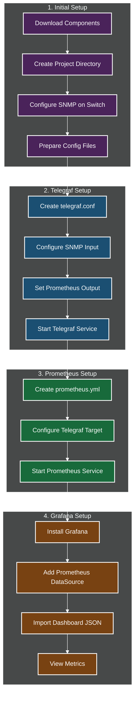
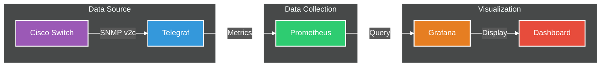
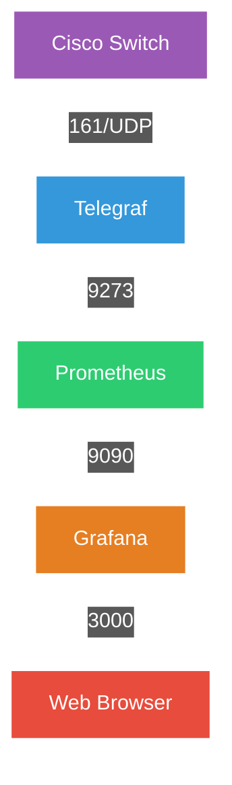
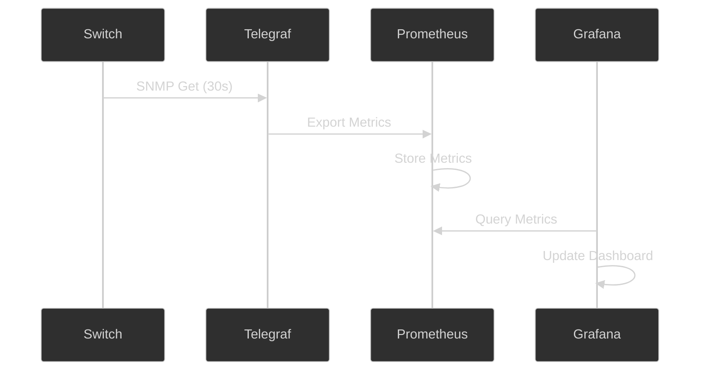

# Cisco Switch Monitoring System Setup Flow

## System Components Setup Flow



## Data Flow Architecture



## Detailed Setup Steps

### 1. Initial Setup
1. Download Components:
   - Telegraf (1.32.3)
   - Prometheus (2.55.1)
   - Grafana (latest)

2. Create Project Directory:
   ```
   telegraf-method/
   ├── telegraf.conf
   ├── prometheus.yml
   └── grafana/
       └── cisco_switch_dashboard.json
   ```

3. Configure SNMP on Switch:
   - IP: 192.168.0.45
   - Version: v2c
   - Community: CiscoSNMP
   - Interfaces:
     * Ethernet0/0: Connected to Internet (Default Gateway)
     * Ethernet0/1: Connected to Laptop NIC

### 2. Telegraf Configuration
1. Create `telegraf.conf`:
   - SNMP input plugin
   - Prometheus output plugin
   - 30s collection interval

2. Configure Metrics:
   - System metrics (uptime, name, CPU, memory)
   - Interface metrics:
     * Ethernet0/0 (Internet): status, traffic, errors
     * Ethernet0/1 (Laptop): status, traffic, errors

3. Start Telegraf:
   ```bash
   telegraf --config telegraf.conf
   ```

### 3. Prometheus Configuration
1. Create `prometheus.yml`:
   - Global settings (30s scrape interval)
   - Telegraf target (localhost:9273)

2. Start Prometheus:
   ```bash
   prometheus --config.file=prometheus.yml
   ```

### 4. Grafana Setup
1. Installation:
   - Download Windows MSI
   - Install and start service
   - Access http://localhost:3000

2. Configuration:
   - Add Prometheus data source
   - Import dashboard JSON
   - View metrics

## Port Configuration



## Metrics Flow



## Dashboard Layout

```mermaid
%%{init: {'theme': 'dark', 'themeVariables': { 'primaryColor': '#2f2f2f', 'textColor': '#fff', 'lineColor': '#fff' }}}%%
graph TB
    subgraph "Cisco Switch Dashboard"
        A[Traffic Graph] -->|Ethernet0/0| B[Internet Traffic]
        C[Traffic Graph] -->|Ethernet0/1| D[Laptop Traffic]
        E[Port Status] -->|Ethernet0/0| F[Internet Status]
        G[Port Status] -->|Ethernet0/1| H[Laptop Status]
        I[System Info] -->|Resources| J[CPU & Memory]
    end

    style A fill:#3498db,stroke:#fff,stroke-width:2px,color:#fff
    style B fill:#2ecc71,stroke:#fff,stroke-width:2px,color:#fff
    style C fill:#e67e22,stroke:#fff,stroke-width:2px,color:#fff
    style D fill:#e74c3c,stroke:#fff,stroke-width:2px,color:#fff
    style E fill:#9b59b6,stroke:#fff,stroke-width:2px,color:#fff
    style F fill:#f1c40f,stroke:#fff,stroke-width:2px,color:#fff
    style G fill:#1abc9c,stroke:#fff,stroke-width:2px,color:#fff
    style H fill:#d35400,stroke:#fff,stroke-width:2px,color:#fff
    style I fill:#8e44ad,stroke:#fff,stroke-width:2px,color:#fff
    style J fill:#27ae60,stroke:#fff,stroke-width:2px,color:#fff

%%{init: {'theme': 'dark', 'themeVariables': { 'primaryColor': '#2f2f2f', 'textColor': '#fff', 'lineColor': '#fff' }}}%%
graph LR
    subgraph "User Interaction"
        U[User via Telegram App]
    end

    subgraph "Bot Service (e.g., Python Script on Windows 11)"
        B[Telegram Bot Service]
        B -->|1. Receives Command| TAPI(Telegram Bot API)
        TAPI -->|2. Sends Command| B
        B -->|4a. Query Metrics| PAPI[Prometheus HTTP API @ localhost:9090]
        B -->|4b. Request Render| GAPI[Grafana HTTP API @ localhost:3000]
        PAPI -->|5a. Return Metric Data| B
        GAPI -->|5b. Return Image| B
        B -->|6. Format & Send Response| TAPI
        TAPI -->|7. Display Response| U
    end

    subgraph "Existing Monitoring Stack (on Windows 11)"
        P[Prometheus]
        G[Grafana]
        G -->|Uses| GR[Grafana Image Renderer Plugin]
        PAPI --> P
        GAPI --> G
    end

    style U fill:#e74c3c,stroke:#fff,stroke-width:2px,color:#fff
    style B fill:#f39c12,stroke:#fff,stroke-width:2px,color:#fff
    style P fill:#2ecc71,stroke:#fff,stroke-width:2px,color:#fff
    style G fill:#e67e22,stroke:#fff,stroke-width:2px,color:#fff
    style GR fill:#e67e22,stroke:#fff,stroke-width:1px,color:#fff,stroke-dasharray: 5 5
    style PAPI fill:#2ecc71,stroke:#fff,stroke-width:1px,color:#fff,stroke-dasharray: 5 5
    style GAPI fill:#e67e22,stroke:#fff,stroke-width:1px,color:#fff,stroke-dasharray: 5 5
    style TAPI fill:#3498db,stroke:#fff,stroke-width:1px,color:#fff,stroke-dasharray: 5 5